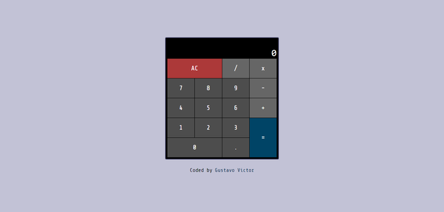
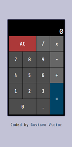

<h1 align='center'>JS Calculator</h1>

<p align="center">
  <a href="#-sobre">Sobre</a>&nbsp;&nbsp;&nbsp;|&nbsp;&nbsp;&nbsp;
  <a href="#-layout">Layout</a>&nbsp;&nbsp;&nbsp;|&nbsp;&nbsp;&nbsp;
  <a href="#-tecnologias-e-ferramentas">Tecnologias e Ferramentas</a>&nbsp;&nbsp;&nbsp;|&nbsp;&nbsp;&nbsp;
  <a href="#-funcionalidades">Funcionalidades</a>&nbsp;&nbsp;&nbsp;|&nbsp;&nbsp;&nbsp;
  <a href="#-instalação">Instalação</a>&nbsp;&nbsp;&nbsp;|&nbsp;&nbsp;&nbsp;
  <a href="#-licença">Licença</a>&nbsp;&nbsp;&nbsp;|&nbsp;&nbsp;&nbsp;
</p>

<p align="center">
    ✔ Projeto concluído
</p>

<p align="center">
    
    
    
    
    
</p>

<hr/>


## ❓ Sobre

Este projeto faz parte de mais um [desafio](https://www.freecodecamp.org/learn/front-end-development-libraries/front-end-development-libraries-projects/build-a-javascript-calculator) da [freeCodeCamp](https://www.freecodecamp.org/) do curso de bibliotecas e frameworks Front-End. O projeto é uma aplicação React que simula algumas funcionalidades de uma calculadora como somar, subtrair, multiplicar, dividir, mostrar e apagar o resultado na tela. O intuito do projeto é treinar as habilidades aprendizas durante curso. 

Clique [aqui](https://fdmomp-5173.csb.app/) para ver o projeto no [CodeSandbox](https://codesandbox.io/). 


## 🎨 Layout

 


## 🛠 Tecnologias e Ferramentas

- Tecnologias
- [HTML](https://developer.mozilla.org/pt-BR/docs/Web/HTML)
- [SASS](https://sass-lang.com/)  
- [ReactJS](https://pt-br.reactjs.org/)
- [TypeScript](https://www.typescriptlang.org/)
- [Vite](https://vitejs.dev/)
- Fontes: [Share Tech Mono](https://fonts.google.com/specimen/Share+Tech+Mono?query=Share+) e monospace

Veja como ficou o arquivo [package.json](./package.json) 


## ⚙ Funcionalidades 

- [x] Somar, subtrair, multiplicar e dividir valores
- [x] Exibir resultado na tela da calculadora
- [x] Resetar ou apagar valores da tela da calculadora


## 💻 Instalação 

Para abrir e executar o projeto no seu computador, você vai precisar ter o [Node.js](https://nodejs.org/en) instalado na sua máquina (recomendo baixar a versão LTS) e o [GIT](https://git-scm.com/) para executar os comandos de terminal a seguir.  
É recomendado ter alguns conhecimentos básicos de HTML, CSS, JavaScript e React para conseguir entender os códigos do projeto e também ter alguma noção prévia de comandos de terminal para conseguir acompanhar as instruções no seu computador. 


1. Faça download do projeto ou clone ele com o seguinte comando no terminal: 

```bash 
    git clone https://github.com/Gustavo-Victor/js-calculator.git
```
 
2. Descompacte o arquivo do projeto e abra a pasta do projeto; se tiver clonado basta só abrir a pasta do projeto; você pode abrir a pasta usando o seguinte comando: 

```bash 
    cd js-calculator/ 
```

3. Instale as dependências necessárias do projeto (a pasta do projeto precisa estar aberta no terminal): 

```bash 
    npm i -g yarn;
    yarn install;
```

4. Executar o projeto em modo de desenvolvimento: 

```bash 
    yarn dev 
```

5. Abrir o projeto no seu navegador de preferência. (Basta digitar na barra de pesquisa: http://localhost:5173/). 


<hr/>

## 📝 Licença 

O projeto está sob a Licensa MIT 

Qualquer pessoa pode usar, clonar e contribuir com este projeto. 

Clique [aqui](./LICENSE.md) para saber mais  
